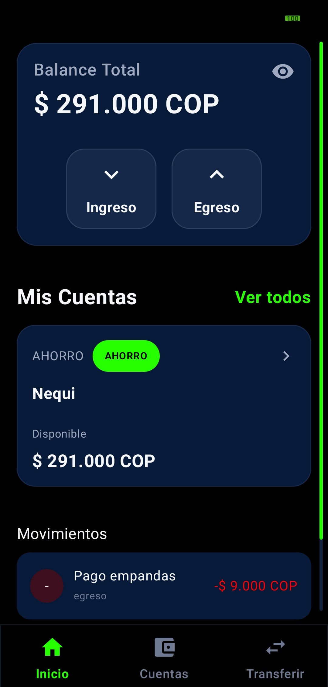
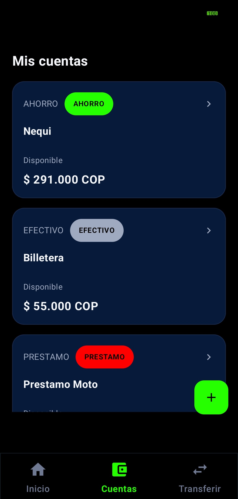
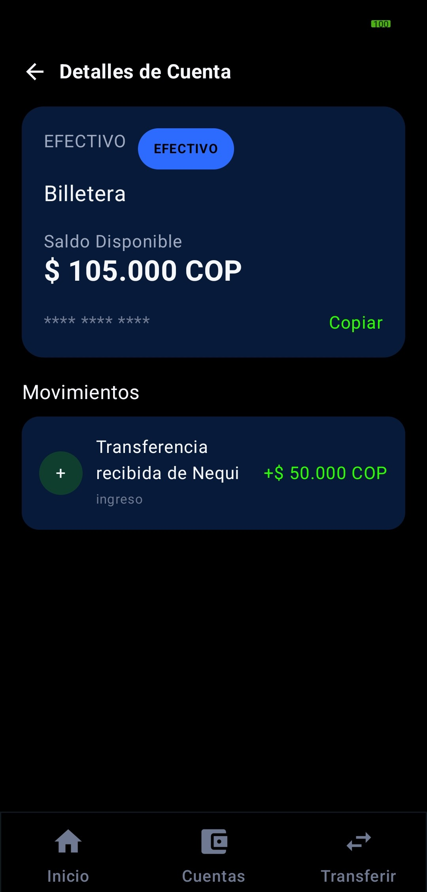
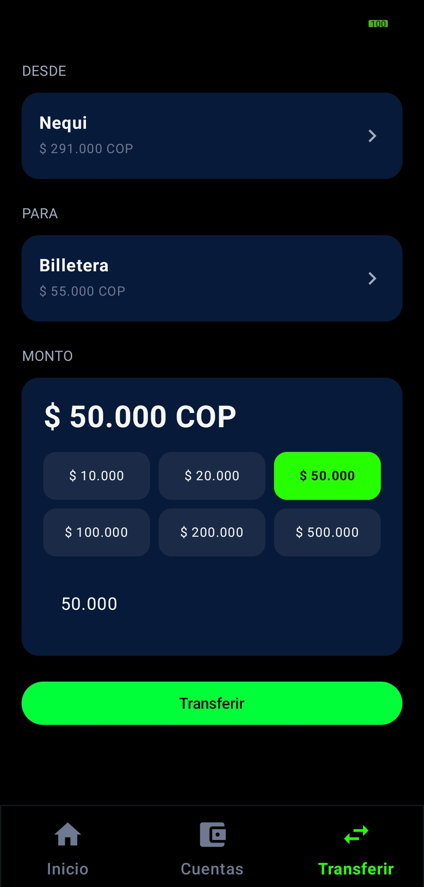
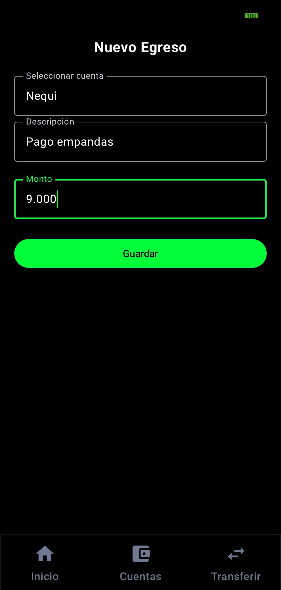

# Diseño de interfaz de usuario

La aplicación cuenta con las siguientes pantallas

1. Pantalla : Inicio

2. Pantalla : Cuentas

3. Pantalla : Detalles de cuenta

4. Pantalla : Transferencias

5. Pantalla : Ingreso / Egreso

# Referencias

- [Material Design: Foundations](https://m3.material.io/foundations)
- [Material Design: Style](https://m3.material.io/styles)
